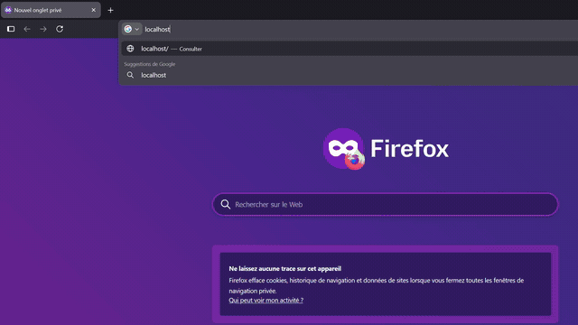

# <p align="center">PanelWizard</p>

PanelWizard is a lightweight and security-focused PHP/MySQL administration panel. It includes a simple installation wizard encrypted database credentials, CSRF protection, secure administrator authentication, and persistent login. Built for PHP 8, Apache, and MySQL/MariaDB.

<p align="center">
  
</p>

## Features

- Automatic installation wizard
- Administrator authentication with bcrypt (Can be changed)
- Prepared PDO queries
- CSRF protection
- AES-256-GCM encrypted MySQL configuration
- Encryption key stored outside the public directory
- Secure 30-day “Remember me” tokens
- Automatic removal of the `install` directory
- Protected configuration directory
- PHP 8 and MySQL/MariaDB support

## Requirements

- Apache 2.4 with `.htaccess` enabled
- PHP 8.0 or later
- PHP extensions: `pdo_mysql`, `openssl`, and `session`
- MySQL 8 or MariaDB
- HTTPS certificate
- SSH access to the production server

## Usage

Clone the repository into your web directory:

```bash
git clone https://github.com/YOUR-ACCOUNT/PanelWizard.git /var/www/panel
```

Create a dedicated MySQL database and user. Do not use the MySQL `root` account in production.

Create a private directory for the encryption key:

```bash
sudo install -d -o www-data -g www-data -m 700 /var/lib/panelwizard
```

Make the directory available to PHP from your Apache virtual host:

```apache
SetEnv PANEL_SECRET_DIR /var/lib/panelwizard
```

Enable HTTPS, allow `.htaccess`, and temporarily give the web-server user permission to write to `key` and remove `install`.

The installer only accepts local server connections. Open an SSH tunnel from your computer:

```bash
ssh -L 8443:127.0.0.1:443 deploy@SERVER_IP_ADDRESS
```

Temporarily map your production domain to `127.0.0.1` in your local `hosts` file, then open:

```text
https://panel.example.com:8443/install/setup.php
```

Enter your MySQL credentials and create the administrator account. When installation finishes, the `install` directory is automatically removed and you are redirected to the login page.

After installation, remove `finalize_install.php`, remove temporary write permissions, delete the temporary `hosts` entry, and confirm that `/install` returns a 404 response.

The “Remember me” option never stores the password. It stores a revocable random token in an `HttpOnly` cookie for up to 30 days.

## Important

Never commit `key/db_config.php`, encryption keys, `.env` files, or backups. A complete backup must include the MySQL database, the encrypted configuration file, and the external key directory.

